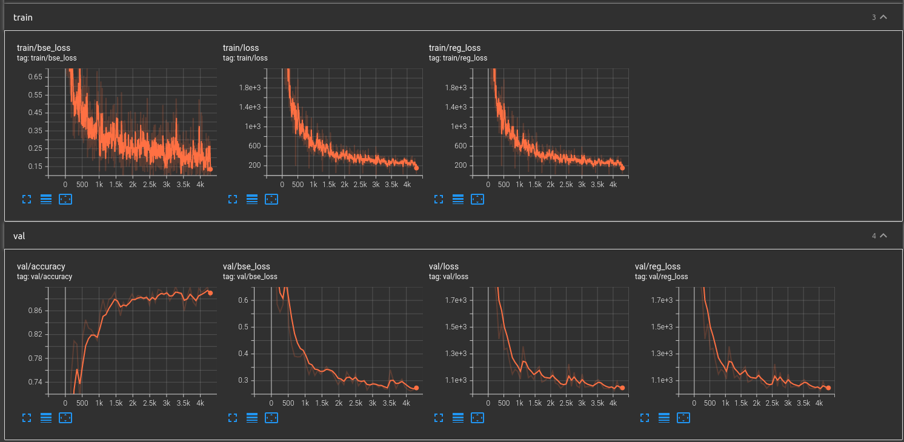

# Traffic Light Detection

## Вопросы
### 1. Что из себя представляют hsv/rgb/bright masks? 

Маска в общем представляет собой бинарное изображение,
в котором значение 1 соответствует пикселям, значения которых превышают определенный порог (threshoald),
0 - не превышают.

**rgb mask** в качестве порога использует значения компонент r, g, b.
**hsv mask** - value (яркость) и saturation (насыщенность).
**bright mask** - value (яркость).

### 2. Почему авторы решили использовать не одно, а два цветовых пространства? 

Авторы используют RGB и HSV цветовые пространства.
RGB пространство - это наиболее обычное представление изображений, которое, благодаря отдельным цветовым компонентам,
можно использовать для легкого сегментирования ламп светофоров по цветам. 
Однако на цветовое пространство RGB влияют различия в освещении, поэтому помимо него авторы используют и HVS модель.
HVS представление учитывает насыщенность и яркость изображения.

### 3. Что авторы называют negative sample? 

Negative sample - регион интереса, который мы выбрали, 
но в котором по разметке отсутствует светофор (например, могла попасть фара машины).

### 4. Почему авторы используют именно такую функцию потерь? Какие альтернативы могут быть уместны? 

В качестве функции потерь авторы используют BCE + 2 * Euclidian distance.
BCE - стандартный loss для задачи бинарной классификации,
Euclidian_distansce - стандартный loss для регрессии (предсказания положений боксов).
Весовой коэффициент 2 используется для улучшения процесса минимизации loss функции для задачи 
регрессии, поскольку она более сложная, чем бинарная классификация.

В качестве альтернативы для Euclidian distance можно использовать, например, Smooth L1 loss.
В качестве альтернативы для BCE можно использовать, например, Focal loss, который хорош при дисбалансе классов.
Также можно попробовать изменить весовой коэффициент.

### 5. Какие модификации вы считаете наиболее привлекательными для повышения точности метода? 

При обработке датасета можно отсечь нижнюю часть изображения, поскольку светофоры расположены выше. Это
поможет избежать ложных срабатываний в нижней части изображения.

В случае, когда в выбранном регионе интереса нашлось 2 объекта, а в разметке 2 светофора, можно разделить эту картинку на
2, посередине между найденными точками, чтоб не выбрасывать из датасета.

Добавить аугментации поворотов на небольшое количество градусов.

Заменить Relu на Leaky Relu либо попробвать другие функции активации.

Можно попробовать использовать изменение learning rate во время обучения.

# Замечания

В предложенной статье присутствует довольно много неточностей, которые могут повлиять на реализацию решения и получаемый результат.

Например, как именно строятся маски с адаптивным threshoald? Как используется sliding window? Как именно объединяются hsv, rgb и bright маски,
на каком этапе? 

Поэтому при реализации были использованы основные идеи статьи, но детали могут отличаться от решения авторов.

# Результаты

В результате удалось провести лишь один эксперимент. 
Было произведено 50 эпох с batch size 50 и 748 итерациями в эпоху.
Для облегчения работы была использована библиотека [pytorch-lightning](https://www.pytorchlightning.ai).
Были получены следующие результаты на тестовой выборке (не использовалась при обучении):
- TP Rate: 0.7198
- Доля FN: 0.1556

Графики процесса обучения:

